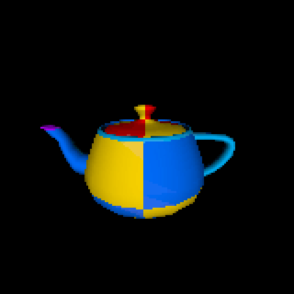

# PixelRenderer
Project developed for a class in university

Reads a vertices and texture coords from a .obj file and creates "mesh" from data.
Renders an image by shooting rays at the mesh and getting the corresponding color for the pixel.

Idea of the project was to easily be able to make pixelart from 3D-Objects.

